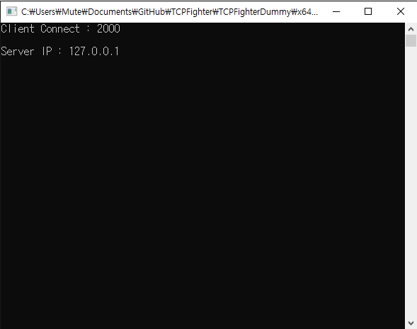
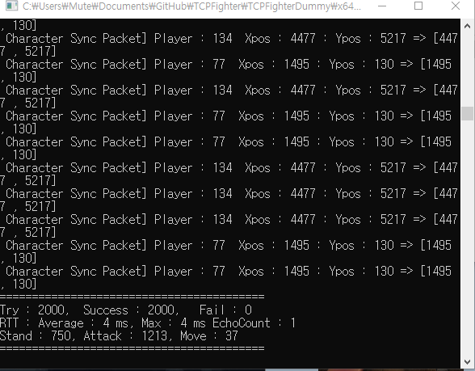
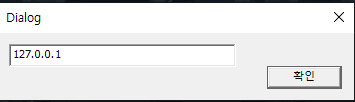
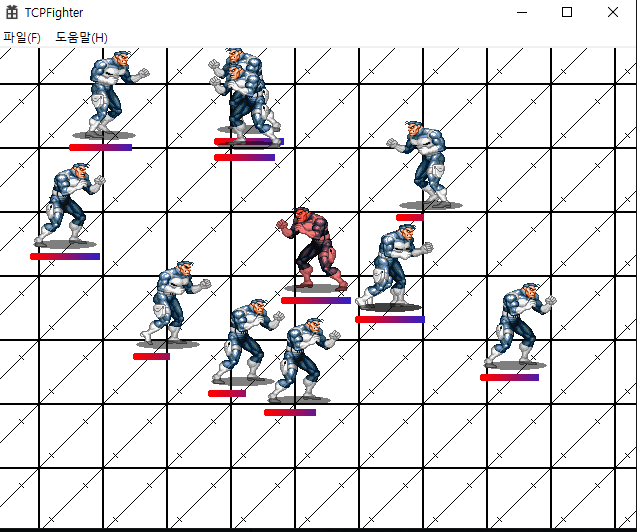

# TCPFighter 

## 구성요소

+ Select 모델 서버
+ Select 모델 더미
+ WSAASyncSelect 모델, Bitmap WinAPI 클라이언트

## 섹터

> 커다란 필드 또는 맵을 구역별로 처리하기 위해서 섹터를 사용합니다.
> 클라이언트는 9개의 섹터를 영향권으로 가지고 있으며, 플레이어가 이동하게되면, 서버는 섹터 업데이트 처리를 합니다.
> 

## 화면

### 서버 화면

`시간당 처리 프레임과 초당 메인 처리 루프를 출력하고 있습니다.`

### 더미 접속 화면

`접속할 인원의 수와 IP를 입력합니다.`

`서버의 데드레커닝 작업에 의해 플레이어가 싱크된 결과와 더미클라이언트의 상태를 모니터링하고 있습니다.`

### 클라이언트 화면

`클라이언트의 접속화면`

`더미 클라이언트가 접속중인 서버에 일반 클라이언트를 접속시킨 상태입니다.`

